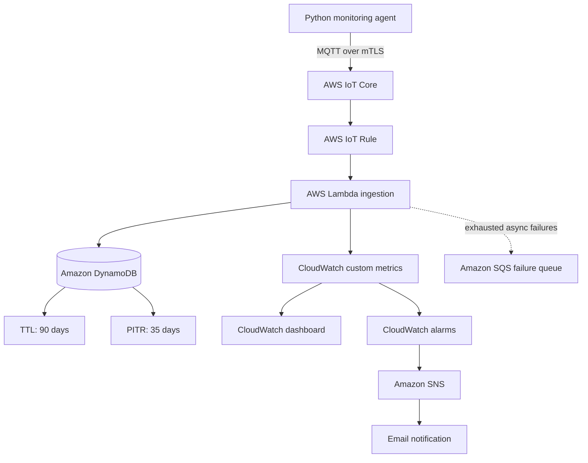
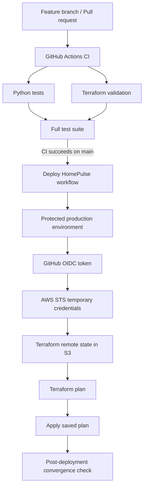

# HomePulse AWS

[](https://github.com/Mibiss/homepulse-aws/actions/workflows/ci.yml)
[](https://github.com/Mibiss/homepulse-aws/actions/workflows/deploy.yaml)

HomePulse is a hybrid edge-to-cloud observability project for monitoring a home network with AWS. A Python agent collects network and host telemetry, publishes it to AWS IoT Core over MQTT with mutual TLS, and a serverless AWS backend validates, stores, monitors, and alerts on the data.

Phase 2 evolved the project from a working cloud prototype into a more production-style implementation with Terraform, automated tests, structured logging, failure retention, data lifecycle controls, heartbeat monitoring, CI, and OIDC-based automated deployment.

## What the project demonstrates

- Hybrid edge-to-cloud architecture
- AWS IoT Core and MQTT over mutual TLS
- Serverless event processing with AWS Lambda
- DynamoDB data modelling, TTL retention, PITR and deletion protection
- CloudWatch custom metrics, dashboards and alarms
- SNS operational notifications
- SQS failed-invocation retention
- Infrastructure as Code with Terraform
- Remote Terraform state in encrypted, versioned S3
- Automated Python and Terraform testing
- Structured JSON logging and failure classification
- GitHub Actions CI/CD
- AWS OIDC federation with short-lived STS credentials
- Protected production deployments and post-deployment convergence checks

## Architecture

### Runtime data path



### Delivery path




The monitoring agent only requires outbound connectivity to AWS. No inbound router ports or port-forwarding rules are required.

## Monitoring agent

`agent.py` runs on macOS or Linux and collects approximately once per minute:

- Internet reachability
- Internet latency
- Internet packet loss
- Orange Livebox reachability
- Livebox latency and packet loss
- Xiaomi/MiWiFi access-point reachability
- MiWiFi latency and packet loss
- DNS lookup success and duration
- Resolved DNS IP address
- CPU utilisation
- Memory utilisation
- Disk utilisation
- Host boot time

The agent publishes JSON telemetry to:

```text
homepulse/homepulse-agent-01/telemetry
```

Authentication uses an AWS IoT X.509 device certificate, private key, and Amazon Root CA.

## Telemetry example

```json
{
  "schema_version": "1.0",
  "device_id": "homepulse-agent-01",
  "timestamp": "2026-08-08T12:00:00+00:00",
  "network": {
    "internet": {
      "reachable": true,
      "latency_ms": 11.9,
      "packet_loss_percent": 0.0
    },
    "livebox": {
      "reachable": true,
      "latency_ms": 3.1,
      "packet_loss_percent": 0.0
    },
    "miwifi": {
      "reachable": true,
      "latency_ms": 2.5,
      "packet_loss_percent": 0.0
    },
    "dns": {
      "success": true,
      "duration_ms": 24.2,
      "resolved_ip": "104.20.23.154"
    }
  },
  "system": {
    "cpu_percent": 9.2,
    "memory_percent": 73.9,
    "disk_percent": 3.6,
    "boot_time": "2026-06-30T12:11:56+00:00"
  }
}
```

## Lambda ingestion

`cloud/lambda/lambda_function.py` performs the serverless ingestion path.

It:

1. validates the schema version, device ID, timestamp and required telemetry objects
2. rejects timestamps more than 24 hours from the current time
3. adds a DynamoDB `expires_at` TTL timestamp
4. stores the complete telemetry event in DynamoDB
5. publishes selected values as CloudWatch custom metrics
6. emits structured JSON logs
7. classifies DynamoDB, CloudWatch and validation failures
8. re-raises failures so Lambda asynchronous retry handling remains effective

### Lambda failure handling

The asynchronous invocation configuration uses:

```text
Maximum retry attempts: 2
Maximum event age:      3600 seconds
On-failure destination: homepulse-lambda-failures (SQS)
```

The SQS failure queue uses server-side encryption and retains failed invocation records for 14 days.

## DynamoDB lifecycle

Telemetry is stored in:

```text
Table:         homepulse-network-metrics
Partition key: device_id
Sort key:      timestamp
```

The table uses on-demand billing and includes:

- 90-day TTL through the `expires_at` attribute
- 35-day point-in-time recovery
- deletion protection

TTL controls normal telemetry retention, while PITR protects against accidental changes or deletion during the recovery window.

## CloudWatch metrics

Custom metrics are published under:

```text
Namespace: HomePulse
Dimension: DeviceId=homepulse-agent-01
```

Metrics:

- `AgentHeartbeat`
- `InternetReachable`
- `InternetLatency`
- `InternetPacketLoss`
- `LiveboxReachable`
- `MiWifiReachable`
- `DnsSuccess`
- `DnsDuration`
- `CpuPercent`
- `MemoryPercent`
- `DiskPercent`

Boolean values are represented as `1` for healthy/successful and `0` for unavailable/failed.

### Dedicated heartbeat

Each successfully processed telemetry event emits:

```text
AgentHeartbeat = 1
```

`HomePulse-Agent-Telemetry-Missing` evaluates the heartbeat over five-minute periods and enters `ALARM` after two consecutive missing/breaching periods. This provides an end-to-end signal across the agent, MQTT publication, IoT routing, Lambda processing, and CloudWatch metric publication.

## Monitoring and alerting

The CloudWatch dashboard includes:

- current network status
- Internet packet loss
- Internet and DNS latency
- monitoring-agent CPU, memory and disk utilisation
- agent heartbeat

Terraform manages these alarms:

- `HomePulse-Agent-Telemetry-Missing`
- `HomePulse-Internet-Unavailable`
- `HomePulse-MiWifi-Unavailable`
- `HomePulse-Lambda-Errors`
- `HomePulse-Lambda-Throttles`

Alarm and recovery state changes are sent to the `homepulse-alerts` SNS topic. The email subscription itself is confirmed manually.

## Structured logging

The agent and Lambda emit single-line JSON logs with event names and contextual fields.

Examples include:

```text
agent_starting
mqtt_connected
telemetry_collected
telemetry_published
telemetry_processing_started
telemetry_stored
metrics_published
telemetry_processing_succeeded
telemetry_validation_failed
dynamodb_write_failed
cloudwatch_publish_failed
```

This makes logs easier to filter and query in CloudWatch Logs Insights.

## Infrastructure as Code

The main Terraform stack is in:

```text
infrastructure/terraform/
```

It manages:

- IoT topic rule and Lambda invocation permission
- Lambda function and execution IAM
- DynamoDB table and data lifecycle controls
- CloudWatch dashboard and alarms
- SNS alert topic
- SQS failure queue
- Lambda asynchronous failure destination

AWS IoT device provisioning (Thing/certificate/device publishing policy) is intentionally outside the current main Terraform stack.

### Bootstrap stacks

Foundational resources are separated from application infrastructure:

```text
infrastructure/bootstrap/state-backend/
infrastructure/bootstrap/github-oidc/
```

`state-backend` creates the S3 bucket used for Terraform remote state with:

- versioning
- AES-256 server-side encryption
- public-access blocking
- `prevent_destroy`

`github-oidc` creates:

- the GitHub OIDC identity provider
- the GitHub Actions deployment role
- permissions for the Terraform state bucket
- permissions required to manage HomePulse infrastructure

The bootstrap stacks are applied manually and are not deployed by the main CD workflow.

## Remote Terraform state

The main stack uses a partial S3 backend configuration:

```hcl
terraform {
  backend "s3" {}
}
```

A local or CI/CD backend configuration supplies values such as:

```hcl
bucket       = "homepulse-terraform-state-UNIQUE_SUFFIX"
key          = "homepulse/prod/terraform.tfstate"
region       = "eu-central-1"
encrypt      = true
use_lockfile = true
```

Never commit the real backend configuration or Terraform state files.

## Automated tests

Tests are implemented with `pytest`.

### Unit tests

The suite covers areas including:

- telemetry collection structure
- ping success, failure and timeout parsing
- structured agent logging
- Lambda telemetry validation
- structured Lambda logging
- DynamoDB failures
- CloudWatch API and connectivity failures
- DynamoDB TTL calculation and storage
- heartbeat metric publication

### Terraform integration tests

The integration suite checks all three Terraform directories:

```text
infrastructure/terraform
infrastructure/bootstrap/state-backend
infrastructure/bootstrap/github-oidc
```

It verifies:

- directories exist
- `terraform fmt -check` passes
- `terraform validate` passes

## Continuous Integration

`.github/workflows/ci.yml` runs on:

- pushes to `main`
- `feature/**` branches
- `fix/**` branches
- pull requests targeting `main`
- manual dispatch

The pipeline contains three jobs:

```text
Python tests
Terraform validation
        \
         -> Full test suite with coverage
        /
```

Terraform is initialized with `-backend=false` during CI so validation does not require access to production state or AWS deployment credentials.

## Automated deployment

`.github/workflows/deploy.yaml` runs after a successful `Continuous Integration` workflow on `main`, or through manual dispatch.

The deployment job:

1. checks out the tested revision
2. enters the protected `production` GitHub environment
3. requests a GitHub OIDC token
4. assumes `HomePulseGitHubActionsDeploymentRole`
5. receives short-lived AWS credentials through STS
6. initializes the real S3 Terraform backend
7. checks formatting and validates Terraform
8. creates and displays a saved Terraform plan
9. applies that exact plan
10. runs `terraform plan -detailed-exitcode` to verify post-deployment convergence

No long-lived AWS access keys are stored in GitHub.

## Security controls

- MQTT over mutual TLS
- local X.509 certificate/private-key storage
- restricted IoT publishing permissions
- Lambda execution role with service-specific permissions
- encrypted S3 Terraform state with versioning
- S3 state lock file
- GitHub OIDC instead of static AWS credentials
- OIDC trust restricted to the repository's production environment subject
- short-lived STS deployment sessions
- protected production GitHub environment
- encrypted SQS failure queue
- DynamoDB deletion protection and PITR
- secrets, local configuration, state and plans excluded by `.gitignore`

## Repository structure

```text
homepulse-aws/
├── .github/
│   └── workflows/
│       ├── ci.yml
│       └── deploy.yaml
├── architecture/
│   ├── architecture.drawio
│   └── architecture.png
├── cloud/
│   └── lambda/
│       ├── README.md
│       └── lambda_function.py
├── dashboard/
│   └── homepulse-dashboard.json
├── infrastructure/
│   ├── bootstrap/
│   │   ├── github-oidc/
│   │   └── state-backend/
│   └── terraform/
├── tests/
│   ├── integration/
│   ├── unit/
│   └── conftest.py
├── agent.py
├── config.env.example
├── pytest.ini
├── requirements.txt
├── requirements-dev.txt
└── README.md
```

## Local agent setup

```bash
git clone https://github.com/Mibiss/homepulse-aws.git
cd homepulse-aws

python3 -m venv .venv
source .venv/bin/activate
python3 -m pip install -r requirements.txt

cp config.env.example config.env
```

Populate `config.env` with your own IoT endpoint, device certificate paths and local network addresses, then run:

```bash
python3 agent.py
```

Do not commit `config.env`, private keys or certificates.

## Run tests locally

Install development dependencies:

```bash
python3 -m pip install -r requirements-dev.txt
```

Run all tests:

```bash
pytest -v
```

Run only unit tests:

```bash
pytest tests/unit -v
```

Run Terraform integration tests:

```bash
pytest tests/integration/test_terraform_configuration.py -v
```

## Terraform checks

```bash
terraform fmt -check -diff -recursive infrastructure
```

For local validation, initialize each configuration first, then run `terraform validate`.

The main application stack uses a remote backend for real planning and deployment. Bootstrap stacks are managed separately.

## Project evolution

### Phase 1 — Working observability platform

- [x] Python monitoring agent
- [x] AWS IoT Core ingestion
- [x] Lambda processing
- [x] DynamoDB telemetry storage
- [x] CloudWatch custom metrics and dashboard
- [x] CloudWatch availability alarms
- [x] SNS outage and recovery notifications
- [x] End-to-end telemetry validation

### Phase 2 — Production-style engineering improvements

- [x] Infrastructure as Code with Terraform
- [x] Remote Terraform state
- [x] Automated unit and infrastructure tests
- [x] Structured JSON logging
- [x] Lambda failure classification and retries
- [x] SQS on-failure destination
- [x] DynamoDB 90-day TTL retention
- [x] DynamoDB 35-day PITR
- [x] DynamoDB deletion protection
- [x] Dedicated heartbeat metric and alarm
- [x] Lambda error and throttle alarms
- [x] GitHub Actions CI pipeline
- [x] GitHub OIDC federation to AWS
- [x] Automated Terraform deployment
- [x] Post-deployment convergence verification

## Licence

This project is licensed under the MIT License. See [`LICENSE`](LICENSE) for details.
