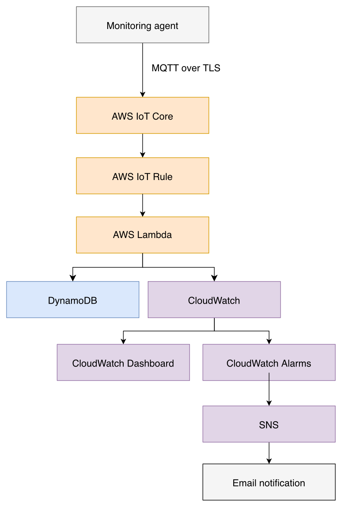

# HomePulse AWS

HomePulse AWS is a home-network observability project that collects connectivity and system-health measurements from a macOS or Linux agent and publishes them securely to AWS IoT Core using MQTT over TLS.

The current version stores each telemetry payload in Amazon DynamoDB through an AWS IoT Rule and AWS Lambda. The Lambda function also publishes selected measurements as Amazon CloudWatch custom metrics for visualisation in a CloudWatch dashboard.

## Current status

* [x] Python monitoring agent
* [x] Internet latency and packet-loss checks
* [x] Livebox reachability checks
* [x] Xiaomi access-point reachability checks
* [x] DNS response-time checks
* [x] Local CPU, memory and disk metrics
* [x] AWS IoT Core MQTT connection
* [x] X.509 certificate authentication
* [x] Least-privilege IoT publishing policy
* [x] AWS IoT telemetry routing rule
* [x] AWS Lambda ingestion
* [x] Amazon DynamoDB telemetry storage
* [x] Manual Lambda ingestion test
* [x] End-to-end live telemetry test
* [x] DynamoDB telemetry queries
* [x] CloudWatch custom metrics
* [x] CloudWatch dashboard
* [x] Five-minute dashboard aggregation
* [x] CloudWatch alarms
* [x] Amazon SNS topic
* [x] Email alert subscription
* [x] Alarm and recovery notification tests
* [ ] Infrastructure as Code
* [ ] Automated tests

## Architecture

### HomePulse AWS — Edge-to-cloud observability architecture



```text
Home monitoring agent
        |
        | MQTT over TLS
        v
AWS IoT Core
        |
        | IoT Rule
        v
AWS Lambda
        |
        +--> Amazon DynamoDB
        |
        +--> CloudWatch custom metrics
                  |
                  +--> CloudWatch dashboard
                  |
                  +--> CloudWatch alarms
                              |
                              v
                         Amazon SNS
                              |
                              v
                     Email notification
```

The monitoring agent runs inside the home network and communicates with AWS through an outbound encrypted MQTT connection. No inbound router ports or port-forwarding rules are required.


## Project components

### Monitoring agent

The monitoring agent is a Python application running on macOS or Linux.

It collects:

* Internet reachability
* Internet latency
* Internet packet loss
* Livebox reachability
* Livebox latency
* Livebox packet loss
* Xiaomi access-point reachability
* Xiaomi access-point latency
* Xiaomi access-point packet loss
* DNS resolution status
* DNS response time
* Resolved IP address
* Local CPU usage
* Local memory usage
* Local disk usage
* Agent boot time

### AWS IoT Core

AWS IoT Core receives telemetry from the monitoring agent over MQTT with TLS.

The device authenticates using:

* An AWS IoT device certificate
* A private key stored locally
* Amazon Root CA 1
* A restricted AWS IoT policy

### AWS IoT Rule

The IoT Rule subscribes to the telemetry topic and invokes the Lambda ingestion function.

Rule name:

```text
homepulse_telemetry_ingestion
```

Rule SQL:

```sql
SELECT *
FROM 'homepulse/homepulse-agent-01/telemetry'
```

### AWS Lambda

The Lambda function:

* Receives telemetry from AWS IoT Core
* Validates the schema version
* Validates the device ID
* Validates the timestamp
* Converts floating-point values to DynamoDB-compatible decimal values
* Writes the complete telemetry document to DynamoDB
* Publishes selected measurements to CloudWatch
* Logs processing results and failures to CloudWatch Logs

Function name:

```text
homepulse-ingestion
```

### Amazon DynamoDB

Raw telemetry is stored in:

```text
homepulse-network-metrics
```

Table key structure:

```text
Partition key: device_id
Sort key:      timestamp
```

Each DynamoDB item represents one complete observation from the monitoring agent.

DynamoDB stores the original nested network and system structures, allowing raw telemetry to be inspected and queried later.

### Amazon CloudWatch

The Lambda function publishes selected telemetry values to the custom namespace:

```text
HomePulse
```

CloudWatch is used for:

* Current network status
* Internet and DNS latency graphs
* Internet packet-loss graphs
* Monitoring-agent resource graphs
* Availability alarms
* Missing-telemetry detection
* Alarm recovery notifications

### Amazon SNS

CloudWatch sends alarm state-change notifications to an Amazon SNS topic,
which delivers them to a confirmed email subscription.

Topic name:

```text
homepulse-alerts
```

The email subscription was confirmed and tested with:

* A direct SNS test message
* Alarm notifications
* Recovery notifications when alarm states returned to `OK`

## CloudWatch alarms

The following availability alarms have been configured and tested.
A high-latency alarm is also documented as an optional future enhancement.

### Agent telemetry missing

Alarm name:

```text
HomePulse-Agent-Telemetry-Missing
```

Configuration:

```text
Metric:               InternetReachable
Statistic:            Minimum
Period:               5 minutes
Datapoints to alarm:  1 out of 1
Missing data:         Treat as breaching
```

This alarm detects when AWS stops receiving telemetry. Possible causes include:

* The monitoring agent stopped
* The Mac entered sleep mode
* Wi-Fi disconnected
* The home internet connection failed
* The AWS IoT ingestion pipeline stopped processing events

### Internet unavailable

Alarm name:

```text
HomePulse-Internet-Unavailable
```

Configuration:

```text
Metric:               InternetReachable
Condition:            Lower than 1
Statistic:            Minimum
Period:               5 minutes
Datapoints to alarm:  1 out of 1
Missing data:         Treat as missing
```

This alarm activates when the monitoring agent explicitly reports that the internet is unreachable.

A complete internet failure may prevent the agent from publishing the failure to AWS. The missing-telemetry alarm therefore complements this alarm.

### Xiaomi access point unavailable

Alarm name:

```text
HomePulse-MiWifi-Unavailable
```

Configuration:

```text
Metric:               MiWifiReachable
Condition:            Lower than 1
Statistic:            Minimum
Period:               5 minutes
Datapoints to alarm:  1 out of 1
Missing data:         Treat as missing
```

This alarm detects a Xiaomi access-point failure while the Livebox and internet connection may still be operational.

### High internet latency

Optional alarm name:

```text
HomePulse-High-Internet-Latency
```

Suggested configuration:

```text
Metric:               InternetLatency
Condition:            Greater than 100 milliseconds
Statistic:            Average
Period:               5 minutes
Datapoints to alarm:  2 out of 3
Missing data:         Treat as missing
```

The latency threshold should be adjusted after observing the connection’s normal behaviour.

## Alarm notification flow

```text
CloudWatch custom metric
        |
        v
CloudWatch alarm
        |
        | ALARM or OK state change
        v
Amazon SNS
        |
        v
Confirmed email subscription
```

Notifications are configured for:

```text
ALARM → failure notification
OK    → recovery notification
```

CloudWatch sends notifications when an alarm changes state rather than sending a new message for every breaching datapoint.

## Alarm testing completed

The alerting system was tested successfully.

### Xiaomi outage test

Test procedure:

1. Keep the monitoring agent running.
2. Disconnect the Xiaomi access point.
3. Confirm the agent reports `reachable: false`.
4. Confirm the CloudWatch alarm changes from `OK` to `ALARM`.
5. Confirm the SNS email notification arrives.
6. Reconnect the Xiaomi access point.
7. Confirm the alarm returns to `OK`.
8. Confirm the recovery email arrives.

### Missing-telemetry test

Test procedure:

1. Stop the monitoring agent.
2. Wait for CloudWatch to evaluate a complete five-minute period without telemetry.
3. Confirm the missing-telemetry alarm changes to `ALARM`.
4. Confirm the SNS email notification arrives.
5. Restart the monitoring agent.
6. Confirm the alarm returns to `OK`.
7. Confirm the recovery email arrives.

## Telemetry topic

The agent publishes to:

```text
homepulse/homepulse-agent-01/telemetry
```

The MQTT browser test client should use a different client ID from the monitoring agent.

Example browser client ID:

```text
iotconsole-generated-client-id
```

Monitoring agent client ID:

```text
homepulse-agent-01
```

Using different client IDs prevents the browser and monitoring-agent connections from disconnecting each other.

## Example telemetry payload

```json
{
  "schema_version": "1.0",
  "device_id": "homepulse-agent-01",
  "timestamp": "2026-07-25T11:13:05.616259+00:00",
  "network": {
    "internet": {
      "reachable": true,
      "latency_ms": 11.964,
      "packet_loss_percent": 0.0
    },
    "livebox": {
      "reachable": true,
      "latency_ms": 3.133,
      "packet_loss_percent": 0.0
    },
    "miwifi": {
      "reachable": true,
      "latency_ms": 2.565,
      "packet_loss_percent": 0.0
    },
    "dns": {
      "success": true,
      "duration_ms": 24.29,
      "resolved_ip": "104.20.23.154"
    }
  },
  "system": {
    "cpu_percent": 9.2,
    "memory_percent": 73.9,
    "disk_percent": 3.6,
    "boot_time": "2026-06-30T12:11:56+00:00"
  }
}
```

## DynamoDB representation

DynamoDB displays values using typed attributes.

Common types used by this project are:

```text
S     String
N     Number
BOOL  Boolean
M     Map or nested object
```

For example:

```text
"latency_ms": { "N": "11.964" }
```

represents a number.

```text
"reachable": { "BOOL": true }
```

represents a Boolean value.

```text
"network": { "M": { ... } }
```

represents a nested map.

DynamoDB does not guarantee the display order of fields inside maps. The order of keys such as `internet`, `dns`, `livebox`, and `miwifi` may therefore differ between items without changing the meaning of the data.

## DynamoDB queries

Telemetry can be queried efficiently using:

```text
Partition key: device_id
Sort key:      timestamp
```

Example PartiQL query for internet measurements:

```sql
SELECT
    "timestamp",
    "network"."internet"."latency_ms",
    "network"."internet"."packet_loss_percent",
    "network"."internet"."reachable"
FROM "homepulse-network-metrics"
WHERE "device_id" = 'homepulse-agent-01'
ORDER BY "timestamp" DESC
```

Example DNS query:

```sql
SELECT
    "timestamp",
    "network"."dns"."success",
    "network"."dns"."duration_ms"
FROM "homepulse-network-metrics"
WHERE "device_id" = 'homepulse-agent-01'
ORDER BY "timestamp" DESC
```

Example system-health query:

```sql
SELECT
    "timestamp",
    "system"."cpu_percent",
    "system"."memory_percent",
    "system"."disk_percent"
FROM "homepulse-network-metrics"
WHERE "device_id" = 'homepulse-agent-01'
ORDER BY "timestamp" DESC
```

## CloudWatch custom metrics

The Lambda function publishes the following custom metrics:

```text
InternetReachable
InternetLatency
InternetPacketLoss
LiveboxReachable
MiWifiReachable
DnsSuccess
DnsDuration
CpuPercent
MemoryPercent
DiskPercent
```

Metrics are published under:

```text
Namespace: HomePulse
Dimension: DeviceId=homepulse-agent-01
```

Metric units:

```text
InternetReachable     Count
InternetLatency       Milliseconds
InternetPacketLoss    Percent
LiveboxReachable      Count
MiWifiReachable       Count
DnsSuccess            Count
DnsDuration           Milliseconds
CpuPercent            Percent
MemoryPercent         Percent
DiskPercent           Percent
```

Boolean status values are represented numerically:

```text
1 = available or successful
0 = unavailable or failed
```

## CloudWatch dashboard

Dashboard name:

```text
HomePulse-Network-Dashboard
```

The dashboard currently contains:

* Current network status
* Internet latency
* DNS response duration
* Internet packet loss
* Monitoring-agent CPU usage
* Monitoring-agent memory usage
* Monitoring-agent disk usage
* Project and metric information

### Dashboard periods and statistics

The monitoring loop performs several network tests before sleeping for 60 seconds. The actual interval between messages can therefore be slightly longer than one minute.

To avoid gaps caused by one-minute CloudWatch buckets, the dashboard uses five-minute periods.

Latency and resource metrics use:

```text
Period:    5 minutes
Statistic: Average
```

This applies to:

```text
InternetLatency
DnsDuration
InternetPacketLoss
CpuPercent
MemoryPercent
DiskPercent
```

Status metrics use:

```text
Period:    5 minutes
Statistic: Minimum
```

This applies to:

```text
InternetReachable
LiveboxReachable
MiWifiReachable
DnsSuccess
```

Using `Minimum` ensures that a single failed status reading during a five-minute period remains visible.

## Requirements

* macOS or Linux
* Python 3
* AWS account
* AWS IoT Core Thing
* Active AWS IoT certificate
* Restricted AWS IoT policy
* AWS IoT Rule
* AWS Lambda function
* Amazon DynamoDB table
* Amazon CloudWatch custom namespace
* Amazon CloudWatch dashboard
* Amazon CloudWatch alarms
* Amazon SNS topic
* Confirmed SNS email subscription
* Network access to the local router and access point

Python dependencies are listed in:

```text
requirements.txt
```

Current dependencies:

```text
awsiotsdk
psutil
python-dotenv
```

## Repository structure

```text
homepulse-aws/
├── README.md
├── agent.py
├── requirements.txt
├── config.env.example
├── .gitignore
├── cloud/
│   └── lambda/
│       ├── README.md
│       └── lambda_function.py
├── architecture/
│   ├── architecture.drawio # in progress
│   └── architecture.png    # in progress
└── dashboard/
    └── homepulse-dashboard.json
```

The following local resources must not be committed:

```text
certificates/
.venv/
config.env
```

## Local setup

Clone the repository:

```bash
git clone https://github.com/Mibiss/homepulse-aws.git
cd homepulse-aws
```

Create a Python virtual environment:

```bash
python3 -m venv .venv
```

Activate it:

```bash
source .venv/bin/activate
```

Install dependencies:

```bash
python3 -m pip install -r requirements.txt
```

Create the local configuration file:

```bash
cp config.env.example config.env
```

Update `config.env` with your real values:

```bash
AWS_IOT_ENDPOINT=YOUR_ENDPOINT-ats.iot.eu-central-1.amazonaws.com
AWS_IOT_CLIENT_ID=homepulse-agent-01
AWS_IOT_TOPIC=homepulse/homepulse-agent-01/telemetry

LIVEBOX_IP=
MIWIFI_IP=

CERT_PATH=/absolute/path/to/certificates/device-certificate.pem.crt
PRIVATE_KEY_PATH=/absolute/path/to/certificates/private.pem.key
CA_PATH=/absolute/path/to/certificates/AmazonRootCA1.pem

COLLECTION_INTERVAL_SECONDS=60
RUN_SPEEDTEST=false
```

Run the agent:

```bash
python3 agent.py
```

Expected output:

```text
Connecting to AWS IoT Core...
Connected.
```

The agent then prints and publishes a telemetry payload.

## Collection interval

The configured sleep interval is:

```text
60 seconds
```

The actual gap between DynamoDB and CloudWatch observations may be slightly longer because the agent first performs:

* Internet ping tests
* Router ping tests
* Access-point ping tests
* DNS resolution
* CPU sampling

It then sleeps for 60 seconds.

The complete cycle is approximately:

```text
metric collection time + 60-second sleep
```

The dashboard uses five-minute periods to account for this collection behaviour.

## AWS IoT policy

The IoT policy allows the agent to connect only with its expected client ID and publish only to its own telemetry topics.

Example:

```json
{
  "Version": "2012-10-17",
  "Statement": [
    {
      "Effect": "Allow",
      "Action": "iot:Connect",
      "Resource": "arn:aws:iot:eu-central-1:ACCOUNT_ID:client/homepulse-agent-01"
    },
    {
      "Effect": "Allow",
      "Action": "iot:Publish",
      "Resource": [
        "arn:aws:iot:eu-central-1:ACCOUNT_ID:topic/homepulse/homepulse-agent-01/telemetry",
        "arn:aws:iot:eu-central-1:ACCOUNT_ID:topic/homepulse/homepulse-agent-01/status"
      ]
    }
  ]
}
```

Replace `ACCOUNT_ID` when creating the real AWS policy.

## Lambda environment variable

The Lambda function uses:

```text
DYNAMODB_TABLE=homepulse-network-metrics
```

## Lambda IAM permissions

The Lambda execution role can write to the HomePulse DynamoDB table:

```json
{
  "Version": "2012-10-17",
  "Statement": [
    {
      "Sid": "WriteHomePulseTelemetry",
      "Effect": "Allow",
      "Action": "dynamodb:PutItem",
      "Resource": "arn:aws:dynamodb:eu-central-1:ACCOUNT_ID:table/homepulse-network-metrics"
    }
  ]
}
```

The Lambda execution role can publish metrics only to the `HomePulse` CloudWatch namespace:

```json
{
  "Version": "2012-10-17",
  "Statement": [
    {
      "Sid": "PublishHomePulseMetrics",
      "Effect": "Allow",
      "Action": "cloudwatch:PutMetricData",
      "Resource": "*",
      "Condition": {
        "StringEquals": {
          "cloudwatch:namespace": "HomePulse"
        }
      }
    }
  ]
}
```

## Testing completed

The following tests have been completed successfully:

* Python agent connected to AWS IoT Core
* MQTT test client received telemetry
* Manual Lambda test returned HTTP status 200
* Manual Lambda test item appeared in DynamoDB
* AWS IoT Rule invoked Lambda
* Live MQTT telemetry appeared automatically in DynamoDB
* Multiple timestamped telemetry records were stored
* Nested network and system maps were stored correctly
* DynamoDB PartiQL queries returned nested measurements
* Lambda published 10 CloudWatch custom metrics
* CloudWatch custom namespace appeared
* Live measurements appeared in CloudWatch
* CloudWatch dashboard displayed network and system measurements
* Five-minute dashboard periods reduced visual gaps
* SNS direct test email arrived
* Missing-telemetry alarm entered `ALARM`
* Missing-telemetry recovery returned to `OK`
* Xiaomi outage alarm entered `ALARM`
* Xiaomi recovery returned to `OK`
* Alarm and recovery emails were delivered successfully

Confirmed end-to-end data flow:

```text
Mac monitoring agent
→ AWS IoT Core
→ AWS IoT Rule
→ AWS Lambda
├── Amazon DynamoDB
└── Amazon CloudWatch
        ├── Dashboard
        └── Alarms
              |
              v
         Amazon SNS
              |
              v
      Email notification
```

## Security

Never commit the following sensitive files:

* Private keys
* Local configuration containing real endpoints or addresses
* AWS access keys
* AWS secret access keys
* AWS credential files
* Terraform state files
* Local virtual environments

This project also keeps device certificates and CA files outside the repository
to simplify certificate management.

Recommended `.gitignore` entries:

```gitignore
# Python
.venv/
venv/
__pycache__/
*.py[cod]
.pytest_cache/

# Local configuration
config.env
.env
.env.*
!.env.example

# Certificates and keys
certificates/
*.pem
*.key
*.crt
*.p12
*.pfx

# macOS
.DS_Store

# Logs
*.log
logs/

# IDE settings
.vscode/
.idea/

# Terraform
.terraform/
*.tfstate
*.tfstate.*
crash.log
```

The agent creates only an outbound TLS connection to AWS IoT Core. No inbound ports or router port-forwarding rules are required.

## Git workflow

Completed milestones:

```text
Build Python network telemetry agent
Add secure AWS IoT MQTT publishing
Add DynamoDB telemetry table
Add Lambda telemetry ingestion
Route IoT telemetry through Lambda
Complete end-to-end DynamoDB ingestion
Add DynamoDB telemetry queries
Publish custom CloudWatch metrics
Create HomePulse CloudWatch dashboard
Configure five-minute dashboard aggregation
Create SNS email notification topic
Add CloudWatch availability alarms
Test outage and recovery notifications
```

## Roadmap

### Version 1

* [x] Python monitoring agent
* [x] AWS IoT Core connection
* [x] Secure MQTT publishing
* [x] AWS IoT Rule
* [x] Lambda ingestion
* [x] DynamoDB storage
* [x] DynamoDB queries
* [x] CloudWatch custom metrics
* [x] CloudWatch dashboard
* [x] CloudWatch alarms
* [x] SNS email notifications
* [ ] Final architecture diagram
* [ ] Project documentation polish

### Version 2

* Infrastructure as Code
* Automated tests
* Structured logging improvements
* Lambda dead-letter handling
* DynamoDB retention strategy
* Dedicated heartbeat metric
* CI pipeline
* Automated deployment

## Licence

This project is intended for educational and portfolio use.

Add a `LICENSE` file before distributing the project or accepting external contributions.
